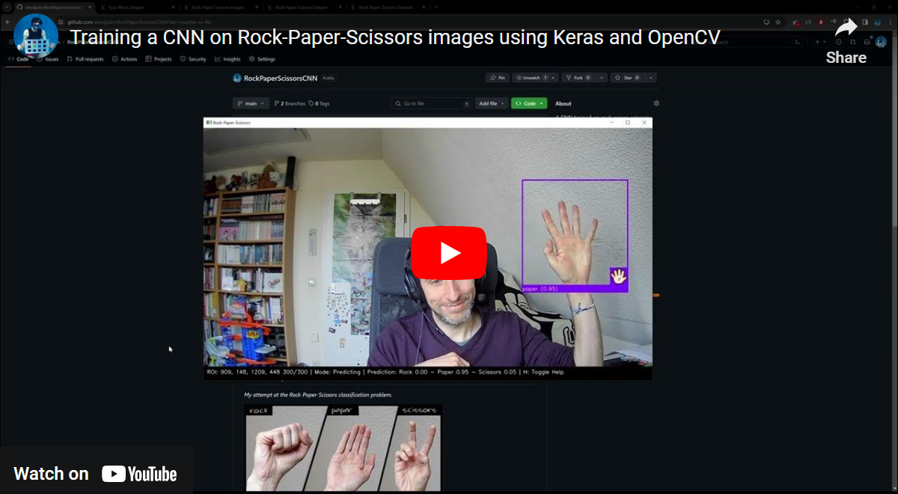
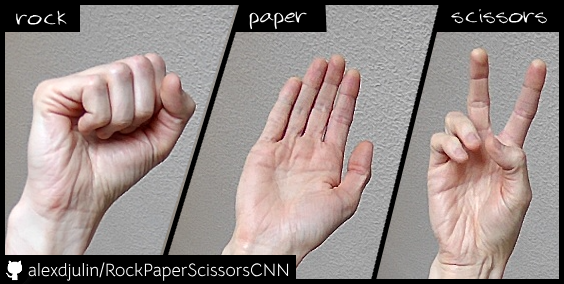

# RockPaperScissorsCNN
_My attempt at the Rock-Paper-Scissors classification problem._


## Video Demo
<a href="https://youtu.be/mjglZWtWQCg" target="_blank"></a>

## Installation
```bash
git clone https://github.com/alexdjulin/RockPaperScissorsCNN.git
cd RockPaperScissorsCNN
python -m venv .venv
.venv/Scripts/activate.bat
pip install -r requirements.txt
```

You will need to install Jupyter Notebook or use an extension to review and execute code from the notebooks listed below.  

## Dataset
I used the following 3 datasets to train the CNN from scratch:

[DRGFREEMAN](https://www.kaggle.com/datasets/drgfreeman/rockpaperscissors)  - Edited to remove the green screen, see _remove_greenscreen_ notebook  
[SANI KAMAL](https://www.kaggle.com/datasets/sanikamal/rock-paper-scissors-dataset)  - Also available in tensorflow_datasets, see _download_dataset_ notebook  
[ALEXDJULIN](https://www.kaggle.com/datasets/alexandredj/rock-paper-scissors-dataset)  -  I created this one myself.  

Download them inside a _dataset_ folder and use the _build_dataset_ notebook to organise all pictures in test/train/validation subfolders.  

  

## Model
The latest version of my model is available here:  
[rps_v01_56ep_0.9641acc_0.1089loss.h5](https://www.kaggle.com/models/alexandredj/rockpaperscissorscnn)

Download it inside a _models_ folder and specify the model path inside the notebooks you want to use. If you leave the path to None, it will use the latest available version.

## Notebooks description
I used the following notebooks to train and test my CNN.  

- [build_dataset.ipynb](https://github.com/alexdjulin/RockPaperScissorsCNN/blob/main/build_dataset.ipynb) - Creates Train, Test and Validation folders for you and copies all the pictures of your different source datasets inside, following a given split ratio (70% / 20% / 10% by default). Images will be renamed to avoid duplicates.
- [train_cnn.ipynb](https://github.com/alexdjulin/RockPaperScissorsCNN/blob/main/train_cnn.ipynb) - Covers all the steps needed to load and prepare your dataset, create the CNN, train it, analyse the results and test the model.
- [rps_main.ipynb](https://github.com/alexdjulin/RockPaperScissorsCNN/blob/main/rps_main.ipynb) - This is my main application to display webcam frames, create a region of interest and use the model to predict hand gestures inside it. A Capture mode lets you capture new images if you want to create your own dataset like I did.
- [remove_greenscreen.ipynb](https://github.com/alexdjulin/RockPaperScissorsCNN/blob/main/remove_greenscreen.ipynb) - A notebook I wrote to remove the green background from drgfreeman's dataset images and reshape them to fit the other two.
- [remove_background.ipynb](https://github.com/alexdjulin/RockPaperScissorsCNN/blob/main/remove_background.ipynb) - A notebook I wrote to experiment removing the background from a ROI using a thresholding method. I implemented it in my main application and improved prediction results on noisy backgrounds.
- [download_dataset.ipynb](https://github.com/alexdjulin/RockPaperScissorsCNN/blob/main/download_dataset.ipynb) - A notebook I used to download the rock-paper-scissors dataset from Tensorflow (SANI KAMAL, same as link above)
